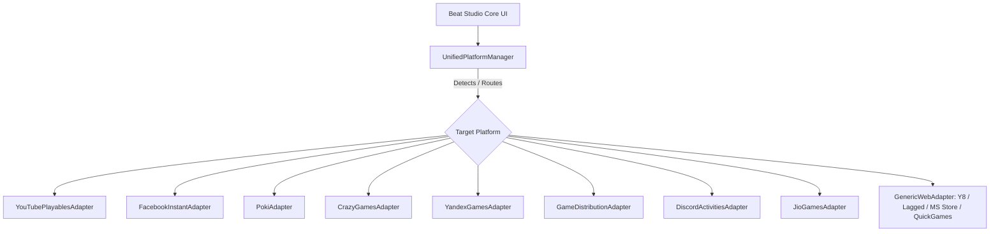

# 🎵 Beat Studio — Spatial Soundscape Synthesizer

<div align="center">

[](#-multi-platform-matrix)
[](#-zero-playgama-architecture)
[](#-apple-design-foundations)
[](#-audio-synthesis-engine)
[](https://www.typescriptlang.org/)
[](LICENSE)

<br />

**An expressive, touch-friendly 16-step spatial soundscape and beat synthesizer designed with Apple Human Interface Guidelines and powered by a native zero-dependency multi-platform engine.**

Built for instantaneous play across YouTube Playables, Facebook Instant Games, Poki, CrazyGames, Discord, Microsoft Store, and major global game portals.

[🌐 Live Demo](https://github.com/Rahul08319/random-soundscape-maker) • [🎮 Multi-Platform Guide](#-multi-platform-matrix) • [🎨 Apple Design Specs](#-apple-design-foundations)

---

</div>

## 📑 Table of Contents

- [Overview](#-overview)
- [Multi-Platform Matrix](#-multi-platform-matrix)
- [Zero-Playgama Native Architecture](#-zero-playgama-native-architecture)
- [Apple Design Foundations](#-apple-design-foundations)
  - [Liquid Glass & Translucent Materials](#1-liquid-glass--translucent-materials)
  - [Fluid Motion & Physical Feedback](#2-fluid-motion--physical-feedback)
  - [Harmonic Real-Time Audio Visualizer](#3-harmonic-real-time-audio-visualizer)
  - [Typography & Layout Grid](#4-typography--layout-grid)
- [Audio Synthesis Engine](#-audio-synthesis-engine)
- [Monetization & Ads](#-monetization--ads)
- [Keyboard Controls](#-keyboard-controls)
- [Local Development & Testing](#-local-development--testing)
- [Platform Submission Guide](#-platform-submission-guide)
- [Author & License](#-author--license)

---

## 🎧 Overview

**Beat Studio** is an ambient music creation experience engineered from the ground up to eliminate third-party wrapper dependencies. It unites procedural oscillator synthesis with an adaptable platform bridge that autodetects and binds natively to 13 gaming portals without bulky SDKs like Playgama.

Featuring Apple-style liquid glass materials, spring-damped micro-interactions, responsive touch ergonomics, and an interactive real-time waveform visualizer, Beat Studio feels like a native piece of hardware in your browser.

---

## 🌐 Multi-Platform Matrix

Beat Studio runs a **Native Multi-Platform Engine** (`src/lib/platform/`) with first-class implementations for all major HTML5 and web runtime ecosystems:

| Platform | Native Bridge / SDK | Cloud Save | Rewarded Ads | Interstitial Ads | Leaderboards |
|---|---|:---:|:---:|:---:|:---:|
| **YouTube Playables** | `ytgame` SDK v1 | ✅ | ✅ | ✅ | ✅ |
| **Facebook Instant Games** | `FBInstant` SDK v7 | ✅ | ✅ | ✅ | ✅ |
| **Poki** | `PokiSDK` v2 | ✅ | ✅ | ✅ | — |
| **CrazyGames** | `CrazyGames.SDK` v3 | ✅ | ✅ | ✅ | ✅ |
| **Yandex Games** | `YaGames` SDK v2 | ✅ | ✅ | ✅ | ✅ |
| **GameDistribution** | `gdsdk` | ✅ | ✅ | ✅ | — |
| **Discord Activities** | Discord Embedded App SDK | ✅ | — | — | ✅ |
| **JioGames** | `jioGames` SDK | ✅ | ✅ | ✅ | ✅ |
| **Y8 Games** | Y8 Account & Ads API | ✅ | ✅ | ✅ | ✅ |
| **Lagged** | Lagged Game API | ✅ | ✅ | ✅ | ✅ |
| **Microsoft Store (PWA)**| Windows App Runtime PWA | ✅ | — | — | — |
| **Huawei & Xiaomi Quick Games** | `qg` Quick Game API | ✅ | ✅ | ✅ | — |
| **MSN & Reddit Games** | Embedded Canvas PostMessage | ✅ | — | — | ✅ |
| **Standalone Web / Dev** | LocalStorage + Web Audio | ✅ | Simulated | Simulated | Local |

---

## ⚡ Zero-Playgama Native Architecture

Unlike monolithic aggregators (such as Playgama), Beat Studio uses direct, isolated native adapters for every platform:



### Key Advantages
1. **Zero Bloat**: No extraneous tracking scripts, no third-party vendor lock-in, and zero wrapper overhead.
2. **Instant Hot-Swapping**: Switch platforms dynamically in development using URL parameters (e.g. `?platform=poki` or `?platform=facebook`) or through the in-game Platform Selector modal.
3. **Resilient Fallbacks**: If any platform API fails or is unreachable, the engine automatically falls back to local storage and browser-native behaviors without breaking user gameplay.

---

## 🍏 Apple Design Foundations

Beat Studio incorporates Apple's design philosophy across every surface:

### 1. Liquid Glass & Translucent Materials
- **Frosted Glass Depth**: Navigation and control bars utilize `backdrop-filter: blur(28px) saturate(190%)` layered over elevated backgrounds (`hsl(232 35% 6% / 0.7)`).
- **Specular Highlights**: Crisp top border reflections (`inset 0 1px 0 rgba(255, 255, 255, 0.12)`) simulate light catching the upper bevel of the glass pane.
- **Continuous Curvature (Squircles)**: Cards and buttons feature smooth G2-style continuous corner curvature rather than harsh boxy radii.

### 2. Fluid Motion & Physical Feedback
- **Tactile Spring Presses**: Controls respond on `pointerdown` with an Apple-style spring scale (`active:scale-[0.96] transition: transform 0.15s cubic-bezier(0.34, 1.56, 0.64, 1)`).
- **Direct Manipulation**: Step cells respond instantly with harmonic neon ripples and playhead luminescence.
- **Master Audio Management**: Direct, frictionless mute/unmute control accessible with one tap or the <kbd>M</kbd> shortcut.

### 3. Harmonic Real-Time Audio Visualizer
- An animated canvas visualizer renders multi-harmonic sine waves live at 60 FPS, reflecting current tempo, active step pulses, and master volume state with zero CPU degradation.

### 4. Typography & Layout Grid
- Strict San Francisco font hierarchy (`-apple-system, BlinkMacSystemFont, "SF Pro Display", "SF Pro Text"`).
- Dynamic Type optical tracking: negative letter spacing on hero headings (`-0.035em`) for punchy titles, balanced with spacious body legibility.

---

## 🔊 Audio Synthesis Engine

Beat Studio creates procedural soundscapes using the browser's native **Web Audio API** — no audio sample files are required:

| Voice | Synthesis Method | Characteristics |
|---|---|---|
| **Kick** | Sine wave oscillator | Rapid pitch sweep from 150 Hz down to 45 Hz with exponential decay |
| **Snare** | Triangle oscillator | Snappy 190 Hz transient with sharp acoustic envelope |
| **Hi-Hat** | Square oscillator | Metallic 6,800 Hz overtone pulse with short 0.2s duration |
| **Clap** | Sawtooth oscillator | Textured 950 Hz burst with warm midrange bite |
| **Bass** | Sub-bass sine oscillator | Warm 62 Hz to 48 Hz pitch slide for atmospheric depth |
| **Shaker** | Pure white noise buffer | Generated 120ms random noise burst through shaped envelope |
| **808 Sub** *(VIP)* | Ultra-low sine oscillator | Deep sub-bass slide from 85 Hz down to 32 Hz with extended sustain |
| **Synth Lead** *(VIP)*| Arpeggiated sawtooth wave | Multi-note pentatonic synthesizer line synchronized to step sequence |

---

## 💰 Monetization & Ads

- **Rewarded Ads (`requestReward`)**:
  - Unlocks the **VIP Neon Sound Pack** (activating the *808 Sub* and *Synth Lead* tracks + 100 bonus mastery points).
  - Works natively with YouTube Playables Rewarded Ads, Facebook Rewarded Video, Poki Rewarded Breaks, CrazyGames Rewarded Ads, and Yandex Rewarded Video.
- **Interstitial Ads (`requestInterstitial`)**:
  - Fires at natural pauses (generating a new groove via *Shuffle* or exporting a project JSON).
  - Protected by a built-in 45-second cooldown timer to preserve the creative flow.

---

## ⌨️ Keyboard Controls

| Key | Action |
|---|---|
| <kbd>Space</kbd> | Toggle Play / Pause |
| <kbd>M</kbd> | Toggle Master Audio Mute |
| <kbd>←</kbd> / <kbd>→</kbd> | Move Step Selector Cursor |
| <kbd>1</kbd> – <kbd>8</kbd> | Toggle Voice Beat on Selected Step |
| <kbd>F</kbd> | Toggle Fullscreen |

---

## 💻 Local Development & Testing

### Installation

```bash
# 1. Clone repository
git clone https://github.com/Rahul08319/random-soundscape-maker.git
cd random-soundscape-maker

# 2. Install dependencies
npm install

# 3. Launch Vite development server
npm run dev
```

### Test Platforms Locally
Append the `?platform=` query parameter to test any platform's SDK behavior:
- `http://localhost:5173/?platform=youtube` (YouTube Playables)
- `http://localhost:5173/?platform=poki` (Poki)
- `http://localhost:5173/?platform=crazygames` (CrazyGames)
- `http://localhost:5173/?platform=facebook` (Facebook Instant Games)
- `http://localhost:5173/?platform=yandex` (Yandex Games)

Or simply click the **Platform Badge** in the top header to open the interactive Platform Selector modal!

### Production Verification

```bash
# Run ESLint
npm run lint

# Compile production build
npm run build

# Preview build locally
npm run preview
```

---

## 📦 Platform Submission Guide

- **YouTube Playables**: Ensure `<script src="https://www.youtube.com/game_api/v1"></script>` is in `<head>`. Upload the `dist/` directory or run in the YouTube Playables Test Suite.
- **Poki**: Include `<script src="https://game-cdn.poki.com/scripts/v2/poki-sdk.js"></script>` when deploying to Poki servers.
- **CrazyGames**: Include `<script src="https://sdk.crazygames.com/crazygames-sdk-v3.js"></script>`.
- **Facebook Instant Games**: Include `<script src="https://connect.facebook.net/en_US/fbinstant.7.1.js"></script>`.
- **Microsoft Store**: Package using PWABuilder with `manifest.json`.

---

## 📄 Author & License

Developed with passion by **[Rahul Kumar](https://github.com/Rahul08319)**.

Released under the **[MIT License](LICENSE)**.
