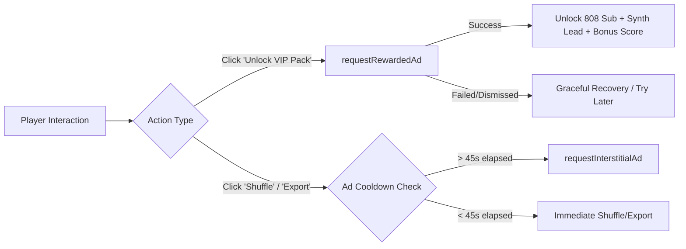

# 🎵 Beat Studio — Random Soundscape Maker

<div align="center">

[](https://developers.google.com/youtube/gaming/playables)
[](https://www.typescriptlang.org/)
[](https://react.dev/)
[](https://vitejs.dev/)
[](https://tailwindcss.com/)
[](https://developer.mozilla.org/en-US/docs/Web/API/Web_Audio_API)

<br />

**A touch-friendly, neon-infused 16-step soundscape & beat sequencer built for YouTube Playables and the modern web.**

Craft ambient loops, shape synthesizer voices, persist grooves to the YouTube cloud, and unlock exclusive sound packs with built-in monetization.

[🎮 Playables SDK Docs](https://developers.google.com/youtube/gaming/playables/reference/sdk) • [🧪 Test Suite Guide](https://developers.google.com/youtube/gaming/playables/reference/test_suite_guide) • [✨ Report an Issue](https://github.com/Rahul08319/random-soundscape-maker/issues)

---

</div>

## 📑 Table of Contents

- [Overview](#-overview)
- [Key Features](#-key-features)
- [YouTube Playables SDK Integration](#-youtube-playables-sdk-integration)
  - [SDK Loading & Lifecycle](#1-sdk-loading--lifecycle)
  - [System Audio & Pauses](#2-system-audio--pauses)
  - [Cloud Storage & Persistence](#3-cloud-storage--persistence)
  - [Monetization & Ads](#4-monetization--ads)
  - [Engagement & Leaderboards](#5-engagement--leaderboards)
  - [Diagnostics & Health Logging](#6-diagnostics--health-logging)
- [Monetization Architecture](#-monetization-architecture)
- [Keyboard Controls](#-keyboard-controls)
- [Playables Test Suite & CSP Setup](#-playables-test-suite--csp-setup)
- [Local Development](#-local-development)
- [Project Architecture](#-project-architecture)
- [License & Author](#-license--author)

---

## 🎧 Overview

**Beat Studio (Random Soundscape Maker)** is an interactive rhythm and ambient synthesizer studio. It bridges zero-latency procedural audio synthesis with full compliance for the **YouTube Playables Web SDK (v1)**.

Whether running inside the YouTube mobile app, the YouTube desktop player, or a local developer environment, Beat Studio seamlessly adapts its audio state, saves sessions to the cloud, respects system pause/resume triggers, and provides built-in monetization through non-intrusive rewarded and interstitial ads.

---

## ✨ Key Features

- **🎛️ 16-Step Dual Grid Sequencer**: Program Kick, Snare, Hi-Hat, Clap, Bass, Shaker, and unlocked VIP instruments (*808 Sub* & *Synth Lead*).
- **🔊 Real-Time Procedural Synthesis**: Web Audio API oscillator chains with exponential frequency drops, white noise generators, and warm filter slopes — no bulky sound files to download.
- **⚡ YouTube Playables Cloud Save**: Saves your patterns, presets, and high scores automatically to YouTube cloud storage (with local storage fallback).
- **💎 VIP Neon Sound Pack (Rewarded Ads)**: Watch an optional rewarded ad to instantly unlock the 808 Sub-Bass and Arpeggiated Synth Lead voices.
- **🎲 Intelligent Groove Shuffler**: Generates dynamic musical soundscapes on the fly, paired with natural breakpoint interstitial ad hooks.
- **🏆 Soundscape Mastery Score**: Automatically syncs rhythm scores to YouTube's player leaderboard UI.
- **🌐 YouTube Inspiration**: Direct deep link to ambient and lofi soundscape streams using `openYTContent`.
- **🛠️ In-Game SDK Diagnostics Modal**: One-click tester for Playables reviewers and certification testers.

---

## 🚀 YouTube Playables SDK Integration

Beat Studio strictly follows the [YouTube Playables Certification Requirements](https://developers.google.com/youtube/gaming/playables/certification/requirements).

| API / Feature | Method | Status | Purpose |
|---|---|:---:|---|
| **Early SDK Load** | `<script src="https://www.youtube.com/game_api/v1"></script>` | ✅ Done | Loaded in `<head>` before any game code bundle |
| **First Frame** | `ytgame.game.firstFrameReady()` | ✅ Done | Notifies host player that rendering has started |
| **Game Ready** | `ytgame.game.gameReady()` | ✅ Done | Signals that loading is finished and game is interactable |
| **Environment Check** | `ytgame.IN_PLAYABLES_ENV` | ✅ Done | Forks behavior between Playables sandbox & local dev |
| **System Audio** | `ytgame.system.isAudioEnabled()` | ✅ Done | Initializes audio state aligned with YouTube player |
| **Audio Change** | `ytgame.system.onAudioEnabledChange()` | ✅ Done | Reactively mutes/unmutes Web Audio Context |
| **System Pause** | `ytgame.system.onPause()` | ✅ Done | Pauses sequencer and flushes state save before eviction |
| **System Resume** | `ytgame.system.onResume()` | ✅ Done | Unpauses UI and restores interactive focus |
| **Language Tag** | `ytgame.system.getLanguage()` | ✅ Done | Adapts BCP-47 locale tag (`en-US`, `es-419`, etc.) |
| **Cloud Load** | `ytgame.game.loadData()` | ✅ Done | Restores serialized state from YouTube cloud |
| **Cloud Save** | `ytgame.game.saveData()` | ✅ Done | Persists UTF-16 JSON (< 3 MiB) to cloud storage |
| **Rewarded Ad** | `ytgame.ads.requestRewardedAd()` | ✅ Done | Unlocks VIP Neon Sound Pack (`reward-vip-sound-pack-1`) |
| **Interstitial Ad** | `ytgame.ads.requestInterstitialAd()` | ✅ Done | Triggers at natural pauses (Shuffle / Project Export) |
| **Send Score** | `ytgame.engagement.sendScore()` | ✅ Done | Transmits integer score to YouTube UI |
| **Open YT Content** | `ytgame.engagement.openYTContent()` | ✅ Done | Opens curated music inspiration video on YouTube |
| **Health Errors** | `ytgame.health.logError()` | ✅ Done | Reports critical caught exceptions to host |
| **Health Warnings** | `ytgame.health.logWarning()` | ✅ Done | Reports recoverable warnings to host |

### 1. SDK Loading & Lifecycle

The SDK script is placed at the very top of `index.html` inside `<head>` before any script modules:

```html
<!doctype html>
<html lang="en">
  <head>
    <!-- YouTube Playables Web SDK MUST be loaded before any game code -->
    <script src="https://www.youtube.com/game_api/v1"></script>
    ...
  </head>
  <body>
    <div id="root"></div>
    <script type="module" src="/src/main.tsx"></script>
  </body>
</html>
```

On app initialization, `ytgame.game.firstFrameReady()` is invoked immediately, followed by state restoration and `ytgame.game.gameReady()` once interactive.

### 2. System Audio & Pauses

```typescript
// Synchronize audio context state with YouTube player settings
const isEnabled = ytgame.system.isAudioEnabled();
ytgame.system.onAudioEnabledChange((enabled) => {
  setIsAudioEnabled(enabled);
  if (!enabled) audioContext.suspend();
});

// Auto-save within the eviction grace period on host pause
ytgame.system.onPause(() => {
  stopPlayback();
  void savePlayableData(JSON.stringify(studioState));
});
```

### 3. Cloud Storage & Persistence

Cloud saves adhere to the Playables specification:
- Enforces valid UTF-16 strings via `String.prototype.isWellFormed()`.
- Validates payload size is strictly within the **3 MiB** threshold.
- Automatically falls back to `localStorage` during local standalone development.

---

## 💰 Monetization Architecture

Beat Studio integrates non-intrusive ads designed to reward player creativity:



### Rewarded Ads (`requestRewardedAd`)
- **Reward Identifier**: `"reward-vip-sound-pack-1"` (clean, user-data-free string).
- **Perk**: Adds the **808 Sub** (deep pitch slide) and **Synth Lead** (arpeggiated pentatonic synth) voices directly to the sequencer.

### Interstitial Ads (`requestInterstitialAd`)
- Triggered at natural creative breakpoints (shuffling a new groove or exporting a project JSON).
- Guarded by a minimum 45-second cooldown timer to ensure a smooth, player-first experience.

---

## ⌨️ Keyboard Controls

| Key | Action |
|---|---|
| <kbd>Space</kbd> | Toggle Play / Pause |
| <kbd>←</kbd> / <kbd>→</kbd> | Move step selector cursor |
| <kbd>1</kbd> – <kbd>8</kbd> | Toggle active track beat on current step |
| <kbd>F</kbd> | Toggle Fullscreen |

---

## 🧪 Playables Test Suite & CSP Setup

YouTube Playables runs games inside a secured sandbox with strict Content Security Policy (CSP) enforcement.

### Recommended CSP Header for Local Testing

When testing locally in Google Chrome DevTools (using [Local Overrides](https://developer.chrome.com/docs/devtools/overrides)), set your `Content-Security-Policy` response header to:

```http
default-src 'none'; script-src 'report-sample' 'self' 'unsafe-eval' 'unsafe-inline' blob: https://www.youtube.com/game_api/v0 https://www.youtube.com/game_api/v0/ https://www.youtube.com/game_api/v1 https://www.youtube.com/game_api/v1/; object-src 'none'; style-src 'self' 'unsafe-inline' https://fonts.googleapis.com; img-src 'self' blob: data:; media-src 'self' blob:; font-src 'self' data: https://fonts.googleapis.com https://fonts.gstatic.com; connect-src 'self' blob: data:; sandbox allow-pointer-lock allow-same-origin allow-scripts; base-uri 'self'; manifest-src 'self'; worker-src 'self' blob:
```

### In-Game Diagnostics Tool
Click the **"Playables Live / Dev"** pill in the top header or the wrench icon (<kbd>🛠️</kbd>) to open the diagnostics panel, where you can directly trigger:
- `Test Interstitial Ad`
- `Test Rewarded Ad`
- `Test Send Score (+50)`
- `Test Health Warning Log`

---

## 💻 Local Development

### Prerequisites
- Node.js 18+ (Node 22 recommended)
- npm or bun

### Setup

```bash
# 1. Clone repository
git clone https://github.com/Rahul08319/random-soundscape-maker.git
cd random-soundscape-maker

# 2. Install dependencies
npm install

# 3. Launch Vite development server
npm run dev
```

### Production Build & Linting

```bash
# Lint with ESLint
npm run lint

# Compile production bundle
npm run build

# Preview build locally
npm run preview
```

---

## 🏗️ Project Architecture

```
random-soundscape-maker/
├── index.html                   # HTML entry point with YouTube SDK in <head>
├── src/
│   ├── components/
│   │   ├── BeatStudio.tsx       # Core 16-step sequencer, mixer, and Playables UI
│   │   └── ui/                  # Accessible shadcn/ui components (Radix primitives)
│   ├── lib/
│   │   ├── youtubePlayables.ts  # Robust Playables SDK lifecycle, ads & cloud adapter
│   │   └── utils.ts             # Styling helpers (clsx + tailwind-merge)
│   ├── types/
│   │   └── ytgame.d.ts          # Official YouTube Playables SDK TypeScript declarations
│   ├── App.tsx                  # Root layout, routing, and toast providers
│   ├── main.tsx                 # React DOM mount
│   └── index.css                # Dark synthwave theme & Playables UI classes
├── .github/workflows/
│   └── verify.yml               # GitHub Actions CI build & verification
└── package.json                 # Project configuration and dependencies
```

---

## 📄 License & Author

Crafted with ❤️ by **[Rahul Kumar](https://github.com/Rahul08319)**.

Open source under the [MIT License](LICENSE).
